# Лабораторная работа №2. Облачные вычислительные сервисы. Amazon EC2

## Шапка

- **ФИО:** Rusnak Daniel
- **Группа:** IA2404
- **Специальность:** Informatică aplicată
- **Выбранный уровень:** продвинутый (задания 1–14)
- **Приложение:** `open_capsules_php_functional` (TimeCapsule, PHP без фреймворка)
- **Вариант деплоя:** A (команды вручную) + реализован B (скрипт `deploy.sh`) как дополнение
- **Репозиторий:** https://github.com/DanielRusnak2025-cloud/timecapsule
- **Регион:** `eu-north-1` (Stockholm) — выбран осознанно вместо `eu-central-1`, см. ADR

---

## Скриншоты базового уровня

### Задание 1. Бюджет ZeroSpend
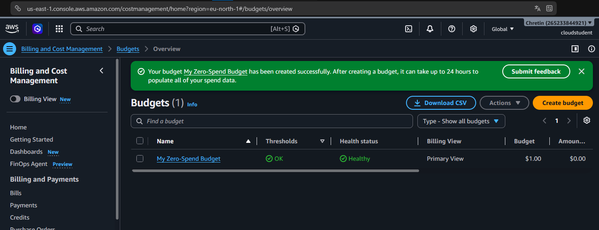
Бюджет с нулевым порогом создан и находится в состоянии Healthy; потрачено $0.00. Виден номер аккаунта и пользователь `cloudstudent`.

### Задание 2. Экземпляр webserver в состоянии Running
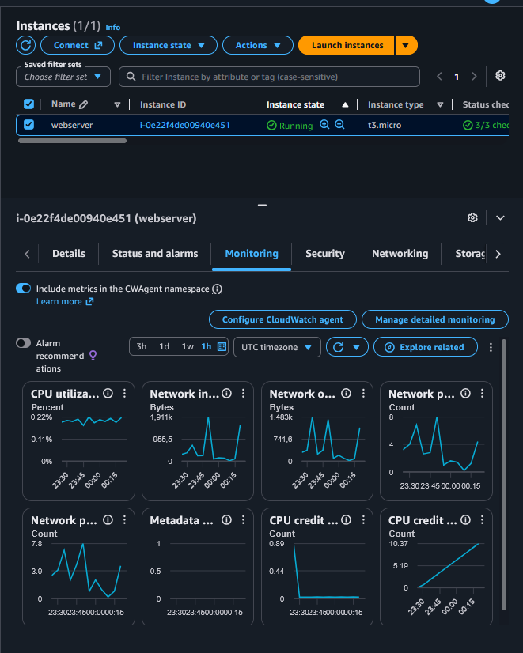
Экземпляр `webserver` (`i-0e22f4de00940e451`, t3.micro) запущен, состояние Running, проверки Status check — 3/3 passed (видно в верхней части снимка).

### Задание 2. Страница nginx по публичному IP
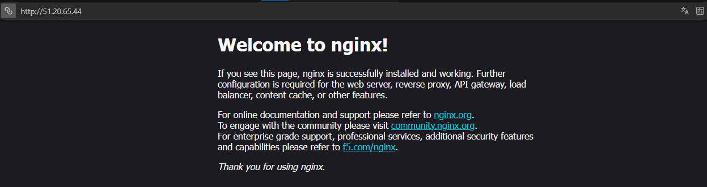
Приветственная страница nginx открывается по публичному IP — скрипт User data автоматически установил и запустил веб-сервер при первом запуске.

### Задание 3. Мониторинг

Вкладка Monitoring с метриками CloudWatch (CPU, сеть, диск) для экземпляра webserver.

### Задание 3. System log
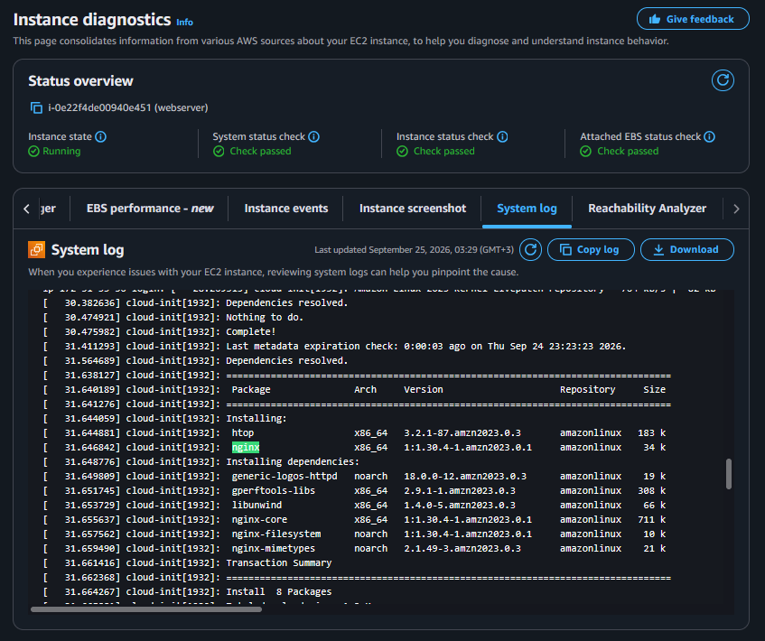
Фрагмент System log: `cloud-init` устанавливает пакет `nginx` из репозитория amazonlinux — подтверждение, что скрипт User data отработал. Status overview: все проверки passed.

### Задание 4. Подключение по SSH и статус nginx
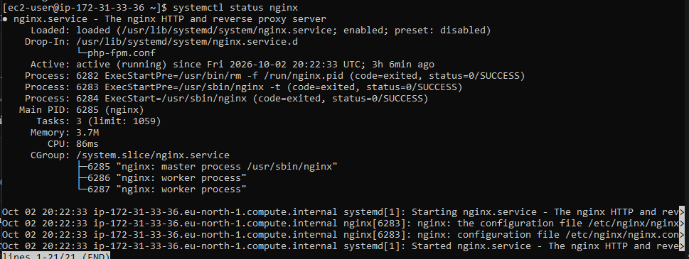
Подключение к серверу по SSH выполнено (приглашение `ec2-user@ip-172-31-33-36`), `systemctl status nginx` показывает `active (running)`.

### Задание 5. Статический сайт
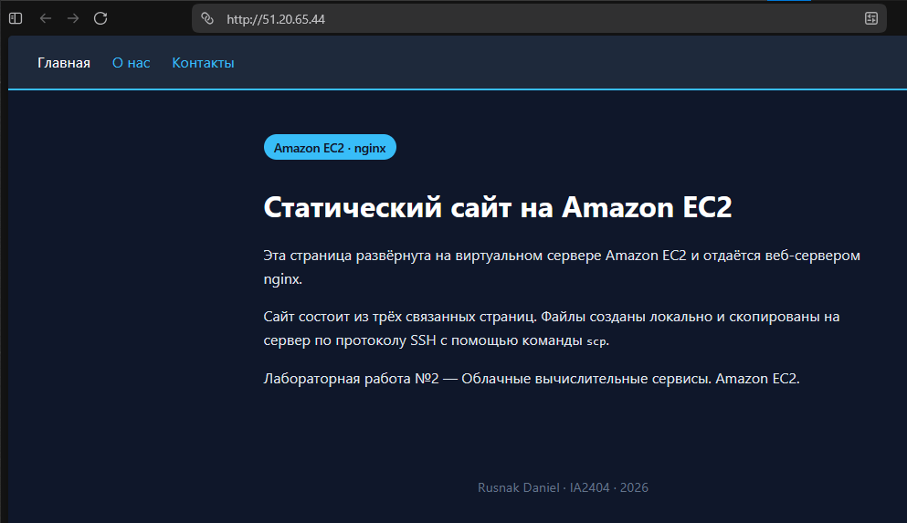
Статический сайт из трёх связанных страниц (Главная / О нас / Контакты) открывается по публичному IP.

### Задание 5. Содержимое папки nginx
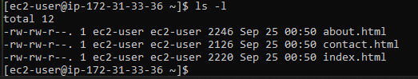
Вывод `ls -l`: три HTML-файла (index, about, contact) на месте.

### Задание 6. Остановка через AWS CLI
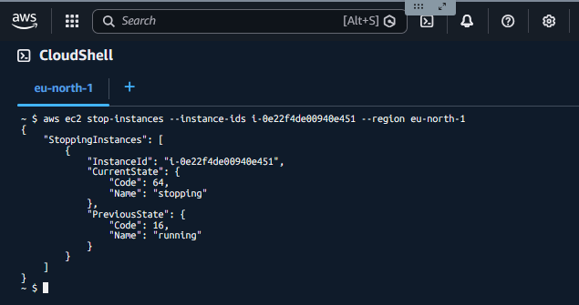
Команда `aws ec2 stop-instances` в CloudShell: `PreviousState: running` → `CurrentState: stopping`.

---

## Скриншоты продвинутого уровня

### Задание 9. Подключение к базе данных
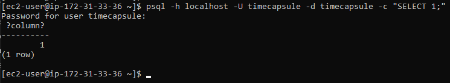
`psql ... -c "SELECT 1;"` возвращает таблицу с числом `1` — база создана, пользователь `timecapsule` подключается по паролю через localhost (метод `scram-sha-256`).

### Задание 10. Создание таблиц
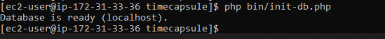
`php bin/init-db.php` выводит `Database is ready (localhost)` — библиотеки установлены, `.env` прочитан, таблицы созданы.

### Задание 11. Запуск приложения
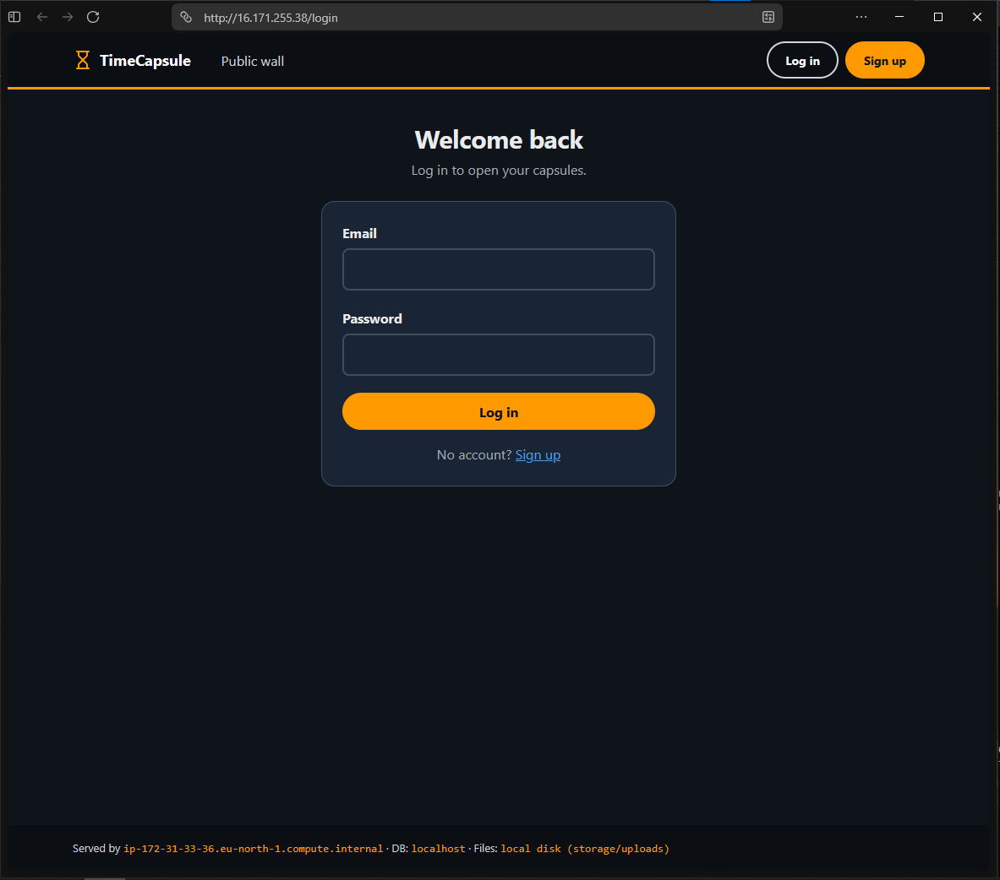
Страница входа TimeCapsule открывается по публичному IP. В подвале видно `Served by ip-172-31-33-36 · DB: localhost · Files: local disk`.

### Задание 11. Проверка /health
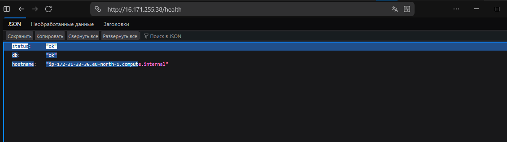
Эндпоинт `/health` возвращает `status: ok`, `db: ok` — приложение работает и видит базу данных.

### Задание 12. Удалённый деплой через deploy.sh
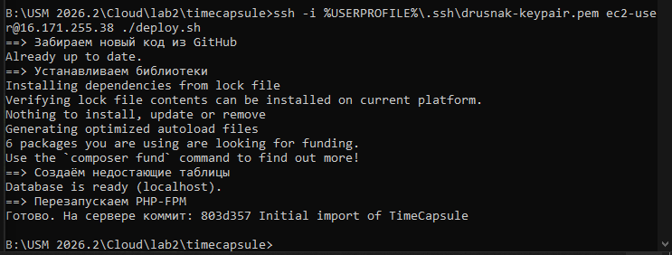
Скрипт `deploy.sh` запущен с компьютера одной командой `ssh ... ./deploy.sh`: проходят все четыре шага (git pull → composer install → init-db → reload php-fpm).

### Задание 13. Новая версия
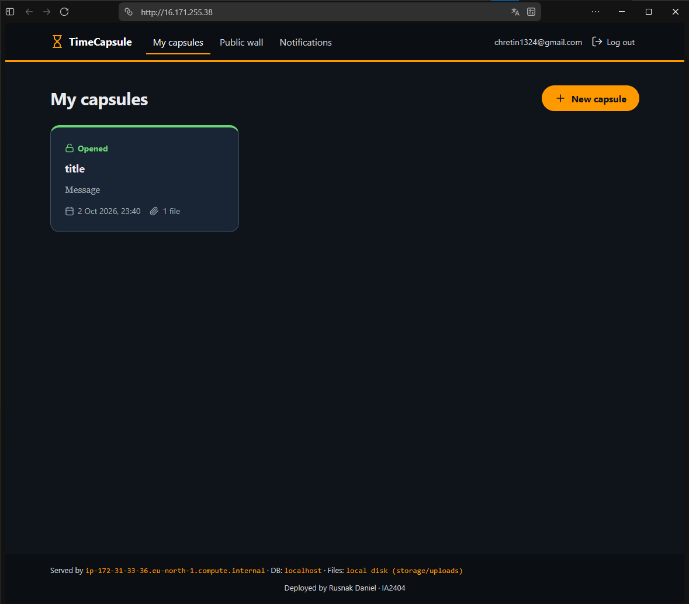
После деплоя в подвале появилась строка «Deployed by Rusnak Daniel · IA2404», капсула с прикреплённым файлом на месте — данные пережили обновление кода.

### Задание 13. Поломка (ошибка 500)
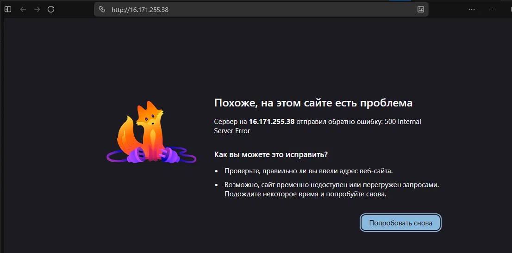
После деплоя сломанного коммита главная страница отдаёт 500 Internal Server Error.

### Задание 13. Сайт после отката
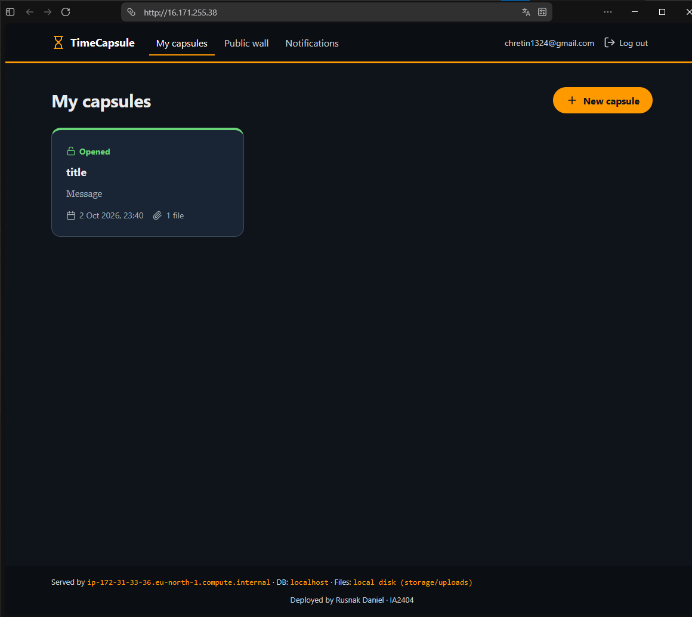
После `git revert` и повторного деплоя сайт снова работает, капсула цела.

---

## Архитектура

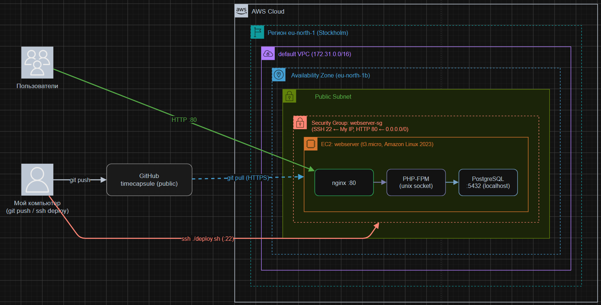

Схема развёртывания: пользователи обращаются к серверу по HTTP (:80); внутри AWS Cloud — регион eu-north-1, default VPC, зона доступности, подсеть и Security Group; на экземпляре EC2 связка nginx → PHP-FPM → PostgreSQL; GitHub вне AWS, сервер забирает код по HTTPS (`git pull`); с компьютера идёт `git push` в GitHub и запуск деплоя по SSH.

**ADR:** [docs/adr/0001-deploy-method.md](docs/adr/0001-deploy-method.md)

---

## Ответы на контрольные вопросы

### Задание 1. Что разрешает политика AdministratorAccess? Почему для повседневной работы нельзя использовать root?
Политика `AdministratorAccess` даёт полный доступ ко всем сервисам AWS и всем действиям над ресурсами, кроме операций самого владельца аккаунта (закрытие аккаунта, изменение платёжных данных). Root — это «главный ключ» от всего аккаунта, привязанный к email регистрации; он всесилен, и если его данные утекут, потерять можно весь аккаунт целиком, без возможности ограничить урон. Поэтому root используют один раз для настройки, а дальше работают под IAM-пользователем с ограниченными правами — это принцип наименьших привилегий.

### Задание 2. Что такое User data и когда выполняется этот скрипт? Выполнится ли он повторно после перезагрузки?
User data — это скрипт, который экземпляр выполняет автоматически один раз при первой загрузке (first boot) сразу после создания. В нашем случае он обновил систему, установил htop и nginx и включил автозапуск nginx. После обычной перезагрузки (reboot) он повторно **не** выполняется: по умолчанию AWS запускает User data только при первичной инициализации экземпляра.

### Задание 3. Какая проверка укажет на вашу проблему, а какая — на проблему AWS?
System status check относится к зоне AWS: он проверяет физический сервер и сеть, на которых работает экземпляр. Instance status check и Attached EBS status check относятся к вашей зоне: они проверяют, загрузилась ли операционная система, отвечает ли она и доступны ли диски. Значит, красный System check — это проблема на стороне AWS, а красный Instance/EBS check — то, что чаще всего можете исправить вы.

### Задание 3. В каких случаях стоит включать детальный мониторинг?
Детальный мониторинг (метрики раз в минуту вместо раз в 5 минут) стоит включать, когда нужна быстрая реакция: при отладке инцидентов, для автомасштабирования и для алармов, где задержка в 5 минут слишком велика и важно вовремя видеть короткие всплески нагрузки. За него берётся отдельная плата, поэтому для обычной работы базового мониторинга достаточно.

### Задание 4. Почему для входа на экземпляр EC2 используется ключ, а не пароль?
Вход по ключу основан на асимметричной криптографии: приватный ключ остаётся только у вас и по сети никогда не передаётся, сервер хранит лишь публичный ключ. При подключении сервер даёт случайную «загадку» (challenge), вы подписываете её приватным ключом, а сервер проверяет подпись публичным. Это надёжнее пароля: подпись одноразовая и перехватывать нечего, сам ключ очень длинный и не поддаётся перебору, и не нужно где-то хранить или вводить пароль, который могут украсть.

### Задание 5. Что делает команда scp и чем она похожа на ssh?
`scp` (secure copy) копирует файлы между компьютером и сервером по защищённому каналу. Она похожа на `ssh` тем, что использует тот же протокол SSH, тот же приватный ключ и то же шифрование соединения. Разница в том, что `ssh` даёт интерактивный терминал на сервере, а `scp` по этому же каналу только передаёт файлы.

### Задание 7. Почему папка vendor/ и файл .env не попали в репозиторий?
Оба перечислены в `.gitignore`, поэтому git их не отслеживает. `vendor/` — это скачанные сторонние библиотеки; их не хранят в репозитории, потому что они много весят и восстанавливаются одной командой `composer install` из `composer.lock`. Файл `.env` содержит пароли и секреты (пароль к базе), которые нельзя публиковать, тем более в публичном репозитории.

### Задание 8. Почему пакеты ставим вручную, а не через User data?
User data выполняется только при первом запуске экземпляра, а наш сервер был создан раньше и уже перезапускался, поэтому добавить в него новый скрипт задним числом нельзя. Кроме того, набор пакетов для приложения уточняется по ходу работы, и ставить их вручную гибче, чем каждый раз пересоздавать экземпляр ради нового User data.

### Задание 10. Почему пароль к базе хранится в .env, а не в коде? Почему публичный репозиторий безопасен?
Пароль хранится в `.env`, потому что этот файл указан в `.gitignore` и не попадает в репозиторий — секреты не должны лежать в коде, особенно публичном. Публичный репозиторий безопасен именно потому, что в нём только код без секретов: пароли, ключи и настройки живут на сервере в `.env`, которого в репозитории нет. Даже прочитав весь код, посторонний не получит доступ к базе.

### Задание 12. Что увидит посетитель во время git pull? Что будет, если не выполнить composer install?
Пока `git pull` заменяет файлы по одному (несколько секунд), посетитель может поймать «половинчатую» версию — часть файлов новая, часть старая, из-за чего страница может выдать ошибку или отрисоваться неправильно. Если после `git pull` не выполнить `composer install`, а новый код требует обновлённую или новую библиотеку, приложение упадёт с ошибкой «класс не найден», потому что содержимое `vendor/` не соответствует новому коду.

### Задание 13. Почему /health отвечает ok, хотя главная сломана? Что он проверяет? Чего ему не хватает?
Сломан был файл `views/layout.php` — общий шаблон обычных страниц, поэтому главная падает с 500. Эндпоинт `/health` обрабатывается отдельным контроллером, который не использует этот шаблон: он лишь проверяет, что PHP отвечает и что база доступна, и оба условия выполнены — отсюда `ok`. Такой проверке не хватает контроля того, что реальные страницы действительно отрисовываются: она не открывает ни одной настоящей страницы, поэтому поломку вёрстки или кода страниц мониторинг по `/health` не замечает.

### Задание 13. Сколько времени сайт был сломан, из чего сложилось это время, как его сократить?
Сайт был недоступен с момента деплоя сломанного коммита до деплоя отката. Это время складывается из обнаружения поломки, диагностики (какой коммит виноват), исправления (`git revert` + `git push`) и повторного деплоя (`git pull` + перезапуск PHP). Сократить его можно автоматическим мониторингом реальных страниц (а не только `/health`), проверкой кода до выкладки (`php -l` и автотесты в скрипте деплоя, чтобы битый коммит вообще не доехал до сервера) и автоматическим откатом при ошибке после деплоя.

---

## Дополнительные устные вопросы (продвинутый уровень)

### Как проходит запрос от браузера до базы данных? Какую роль играет каждая программа?
Браузер шлёт HTTP-запрос на порт 80, его принимает **nginx** — веб-сервер; статические файлы (CSS, JS, картинки) он отдаёт сам. Если нужна динамика, nginx через unix-сокет передаёт запрос в **PHP-FPM**, который выполняет PHP-код приложения. Коду нужны данные — он обращается к **PostgreSQL** на localhost:5432. PostgreSQL возвращает данные в PHP, PHP формирует HTML и отдаёт его nginx, а тот — браузеру.

### Почему сервер может скачивать код из репозитория, но не отправлять в него? Почему это правильно?
Репозиторий публичный, поэтому читать (`git clone`/`git pull` по HTTPS) его может кто угодно, в том числе сервер, без всяких ключей. А чтобы отправить изменения (`git push`), нужен вход в аккаунт GitHub, которого у сервера нет. Для сервера это правильно с точки зрения безопасности: даже если его взломают, злоумышленник не сможет изменить код в репозитории — источник кода остаётся неприкосновенным.

### Что произойдёт с загруженными файлами, если удалить экземпляр EC2? Как это связано с EBS?
Файлы, загруженные пользователями, лежат на локальном диске сервера — это том EBS, подключённый к экземпляру. При **остановке** (Stop) том сохраняется, при **удалении** (Terminate) корневой том EBS по умолчанию удаляется вместе с экземпляром, и все загруженные файлы пропадают навсегда. Поэтому хранить важные пользовательские файлы на диске одного экземпляра ненадёжно — в следующих работах их выносят в отдельное хранилище (например, S3).

### Что общего у вашего deploy.sh с CI/CD? Чего ещё не хватает?
`deploy.sh` делает то же, что и ядро CI/CD: по одной команде берёт код из репозитория и выкладывает его на сервер фиксированной последовательностью шагов. Не хватает автоматического запуска (деплой пока стартует вручную), проверки кода до выкладки (линтер, автотесты), а также мониторинга реальных страниц и автоматического отката при ошибке — всё это добавляют настоящие системы CI/CD.

### Stop vs Terminate. За что платим, пока экземпляр остановлен?
Stop выключает экземпляр с сохранением диска EBS — его можно включить обратно. Terminate удаляет экземпляр и его корневой том навсегда. Пока экземпляр остановлен, вы не платите за вычислительное время, но продолжаете платить за хранение тома EBS (и за зарезервированные ресурсы вроде Elastic IP, если они есть).

---

## Вывод

В ходе работы развёрнуто полноценное веб-приложение TimeCapsule на экземпляре Amazon EC2: от запуска виртуальной машины и настройки сети до связки nginx + PHP-FPM + PostgreSQL. Освоены запуск и диагностика экземпляра, подключение по SSH, развёртывание кода из репозитория GitHub, выпуск новых версий через скрипт `deploy.sh`, а также цикл поломки и отката через `git revert`. Код доставляется по профессиональной схеме: репозиторий — единственный источник правды, сервер сам забирает код по HTTPS.

## Список источников
1. Условие лабораторной работы №2 (CCru, USM).
2. Лекция 4 «Вычислительные сервисы. Amazon EC2 и machine identity», Hands-on 4.1–4.3.
3. Документация AWS: EC2, CloudWatch, IAM, Budgets.
4. Документация nginx, PHP-FPM, PostgreSQL.
